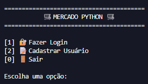
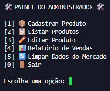
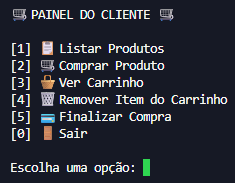

# 🛒 Mercado Python

Sistema de mercado desenvolvido em Python para trabalho do curso de Desenvolvimento de Sistemas.

## 📌 Sobre o projeto

O **Mercado Python** é um sistema simples executado pelo terminal, criado para simular o funcionamento básico de um mercado.

O projeto permite o cadastro de usuários, login com diferentes tipos de acesso, cadastro e edição de produtos, controle de estoque, carrinho de compras, finalização de compras e relatório de vendas.

Os dados do sistema são salvos em um arquivo JSON, permitindo manter usuários, produtos, carrinhos e vendas mesmo após fechar o programa.

## 🖼️ Demonstração

### Menu inicial

### Painel do administrador

### Painel do cliente

## ⚙️ Funcionalidades

### 👤 Usuários

- Cadastro de usuários
- Login de administrador e cliente
- Separação de permissões por tipo de usuário

### 🛠️ Administrador

- Cadastro de produtos
- Listagem de produtos
- Edição de preço
- Edição de estoque
- Acréscimo de quantidade ao estoque
- Relatório de vendas
- Limpeza dos dados do mercado

### 🛒 Cliente

- Listagem de produtos disponíveis
- Compra de produtos
- Carrinho individual por cliente
- Remoção de itens do carrinho
- Finalização de compra

### 💾 Persistência de dados

- Salvamento automático dos dados em JSON
- Carregamento dos dados ao iniciar o sistema
- Armazenamento de usuários, produtos, carrinhos e vendas

## 🧰 Tecnologias utilizadas

- Python
- JSON
- Terminal/Console

## 🧠 Conceitos aplicados

- Funções
- Dicionários
- Listas
- Estruturas condicionais
- Laços de repetição
- Tratamento de erros
- Manipulação de arquivos JSON
- Organização de código
- Type hints

## ✅ Requisitos

- Python 3 instalado

Não é necessário instalar bibliotecas externas.

## 👥 Participantes

- [Davi Delmondes](https://github.com/davi-delmondes)
- [João Marcelo](https://github.com/Joaomarcelloo-dev)
- [João Daniel](https://github.com/joao-daniell)
- [Lorrã Myguel](https://github.com/lorra-myguel)

## ▶️ Como executar

1. Baixe ou clone este repositório.
2. Abra a pasta do projeto no VS Code ou em outro editor.
3. Execute o arquivo principal no terminal:

    python mercado_python.py

## 📁 Estrutura do projeto

    mercado-python/
    │
    ├── assets/
    │   ├── menu-inicial.png
    │   ├── painel-admin.png
    │   └── painel-cliente.png
    │
    ├── mercado_python.py
    ├── README.md
    ├── .gitignore
    └── dados_mercado_python_exemplo.json

## 📄 Arquivo de dados

O sistema cria automaticamente um arquivo chamado:

    dados_mercado_python.json

Esse arquivo é usado para salvar os dados do sistema, como usuários, produtos, carrinhos e vendas.

Caso não queira enviar dados salvos para o GitHub, recomenda-se manter esse arquivo no `.gitignore`.

Este repositório também inclui um arquivo de exemplo chamado:

    dados_mercado_python_exemplo.json

Ele serve apenas para mostrar a estrutura inicial dos dados.

## 📚 Observação

Este projeto foi desenvolvido com fins educacionais, como parte de uma atividade do curso de Desenvolvimento de Sistemas.

O objetivo principal foi praticar lógica de programação, organização de código, manipulação de dados e persistência com JSON usando Python.
